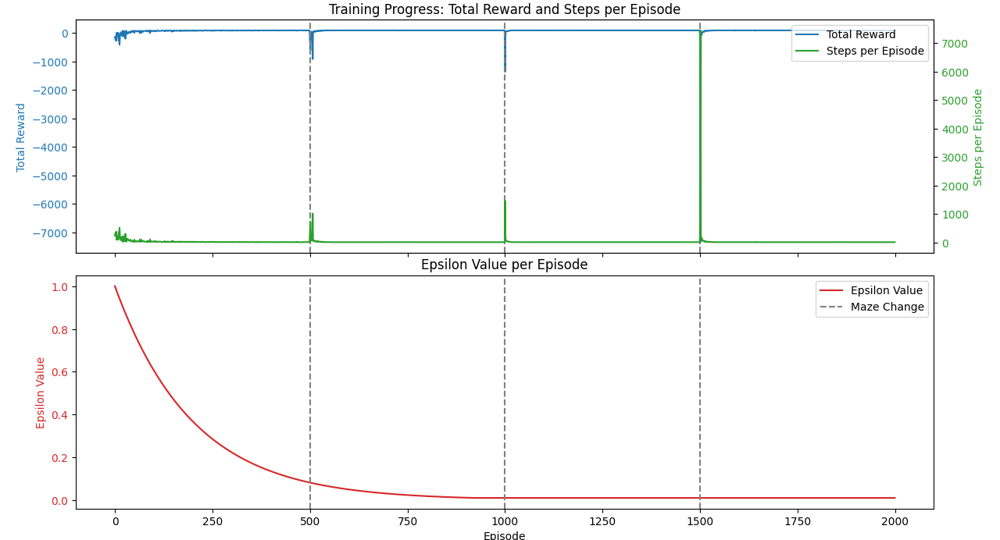

# Reinforcement Learning Maze Navigation with Pygame and Matplotlib

## Introduction

This project demonstrates how a reinforcement learning agent can learn to navigate mazes using Q-learning, a model-free RL algorithm. The agent explores the environment, updates its knowledge (Q-values), and improves its policy over time to find the optimal path to the goal. The agent is trained on multiple mazes sequentially, transfering learning to apply knowledge from previous mazes to new ones.

## Usage

Install the required Python packages using the following command:

`pip install pygame numpy matplotlib`

Run the script:

`python main.py`

Observe the Output:

- A Pygame window will open, displaying the maze and the agent (blue square).
- The agent will start exploring the maze, learning to reach the goal (green square).
- After every 500 episodes, a new maze is introduced.
- Training progress plots will display after the training is complete.

## Example data

### Total Reward
The Total Reward is the cumulative sum of rewards an agent earns during an episode. In the maze navigation context, the agent receives negative rewards for each step taken and a positive reward when it reaches the goal. A higher total reward indicates more efficient navigation (fewer steps) and successful completion of the task. Over time, the total reward should increase as the agent learns to reach the goal faster.

### Steps per Episode
The Steps per Episode metric tracks the number of steps the agent takes to complete an episode, where an episode ends either when the agent reaches the goal or a time limit is reached. As the agent learns, the number of steps should decrease, indicating that it is finding shorter, more efficient paths to the goal.

### Epsilon Value
The Epsilon Value controls the agent's exploration versus exploitation behavior during learning. A higher epsilon value means the agent is more likely to explore by taking random actions, while a lower epsilon value means the agent will exploit its learned knowledge to take the best-known actions. Epsilon typically starts high and decays over time, allowing the agent to explore initially and then focus on exploiting efficient strategies as it learns.

## Resources

This maze is a highly simplified use case of RL. It is not the best example that demonstrates the value of RL, so I recommend giving the following video a watch. OpenAI Multi-Agent Hide and Seek

https://www.youtube.com/watch?v=kopoLzvh5jY